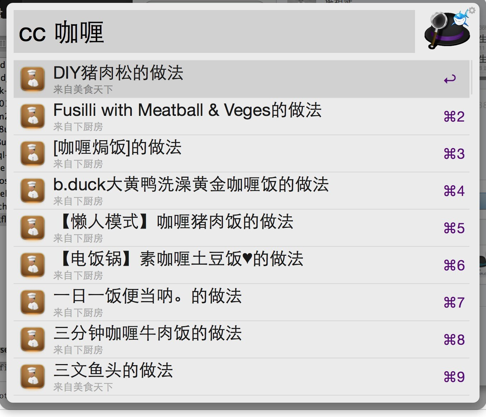

cookbook
========

#For AlfredWorkFlow2 菜谱搜索

##安装
[点我直接下载“菜谱.workflows”](https://raw.githubusercontent.com/jShi-git/cookbook/master/download/%E8%8F%9C%E8%B0%B1.alfredworkflow)

##项目说明
输入食材或菜名，搜索菜谱
> Usage: cc 水煮鱼

##TODO
- 添加速度更快的数据源

##运行效果

